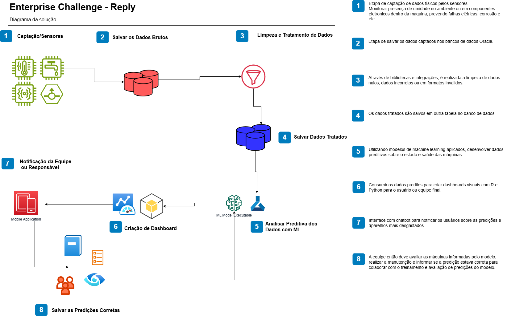

# FIAP - Faculdade de Informática e Administração Paulista

 

# Enterprise Challenge - Sprint 1 - Reply

## Nome do Grupo

- Arthur Luiz Rosado Alves -> RM562061
- Renan de Oliveira Mendes -> RM563145

## Sumário

[1. Justificativa do Problema](#c1)

[2. Descrição da Solução Proposta](#c2)

[3. Tecnologias Propostas](#c3)

[4. Pipeline de Dados](#c4)

[5. Diferencial com IA Integrada e Comunicação Inteligente](#c5)

[6. Infraestrutura de Execução](#c6)

[7. Plano Inicial de Desenvolvimento](#c7)

[8. Diagrama](#c8)

 

# 1. Justificativa do Problema

*Máquinas industriais frequentemente enfrentam paradas inesperadas nas linhas de produção, gerando perdas financeiras, atrasos logísticos e riscos à segurança. A ausência de um sistema preditivo e em tempo real dificulta a prevenção de falhas. Nossa solução busca monitorar continuamente os equipamentos, identificar os padrões de falhas e antecipar as manutenções. Promovendo um ambiente mais eficiente, seguro e entregando uma solução de qualidade.*

# 2. Descrição da Solução Proposta

Vamos desenvolver uma plataforma inteligente de monitoramento industrial, integrando sensores IoT, armazenamento em nuvem, processamento com IA e dashboards interativos. O sistema será capaz de:

- **Coletar dados em tempo real via sensores**;

- **Armazenar os dados em um banco de dados na nuvem;**

- **Aplicar algoritmos de machine learning para predição de falhas;**

- **Notificar automaticamente os funcionários via aplicativo;**

- **Exibir insights e relatórios em dashboards.**

# 3. Tecnologias Propostas/Planejadas

| Camada            | Tecnologias                           |
|-------------------|----------------------------------------|
| Sensoriamento     | ESP32 com sensores                    |
| Armazenamento     | PostgreSQL (local ou em nuvem)        |
| Backend APIs      | Python                                |
| IA / ML           | Scikit-learn, TensorFlow, Keras       |
| Notificações      | Telegram Bot, WhatsApp API            |
| Infraestrutura    | AWS EC2, Lambda, S3                   |

# 4. Pipeline de Dados

**Sensores IoT captam dados de:**

-Vibração anormal;

-Temperatura excessiva;

-Umidade.

-Transmissão dos dados para servidor de ingestão.

-API Coletar Dados armazena no banco de dados hospedado em nuvem.

**API Análise de Dados:**

-Realiza pré-processamento e normalização;

-Usa modelos preditivos treinados com histórico;

-Classifica anomalias e riscos de falha.

**API Dashboard exibe:**

-Status dos sensores;

-Alertas preditivos;

-Relatórios de eficiência e manutenção sugerida.

**Notificações automatizadas:**

-Funcionários são avisados por texto, áudio ou chatbot com recomendações práticas (ex: "Reduza carga da máquina 02, risco de falha em 12h").*

# 5. Diferencial com IA Integrada e Comunicação Inteligente

*Além da predição de falhas, a IA utilizará técnicas de Processamento de Linguagem Natural (NLP) para traduzir insights técnicos em mensagens compreensíveis aos operadores, como:

"A máquina 3 apresentou aumento de vibração fora do padrão. Recomendamos inspeção preventiva nas próximas 4 horas."

Isso pode ser integrado com:

Chatbots internos (Telegram, WhatsApp, Microsoft Teams);

Notificações com áudio gerado por IA para áreas barulhentas (Text-to-Speech).*

# 6. Infraestrutura Planejada de Execução

*Coleta local: ESP32.

Processamento em nuvem: AWS EC2 com Python ou alternativa.

Armazenamento escalável: AWS RDS (PostgreSQL) ou alternativa.

Visualização: Dashboards via React, Dash ou Grafana.

Notificações: APIs de envio com IA + NLP.*

# 7. Plano Inicial de Desenvolvimento

| Etapa | Atividade                            | Responsável         |
|-------|--------------------------------------|----------------------|
| 1     | Escolha e simulação de sensores      | Integrador IoT       |
| 2     | Criação das APIs                     | Dev Backend          |
| 3     | Pipeline de ingestão de dados        | Dev Backend          |
| 4     | Treinamento do modelo de IA          | Cientista de Dados   |
| 5     | Desenvolvimento de dashboards        | Dev Frontend         |
| 6     | Mensagens com NLP e voz              | Especialista NLP     |

# 8. Diagrama

</a>

